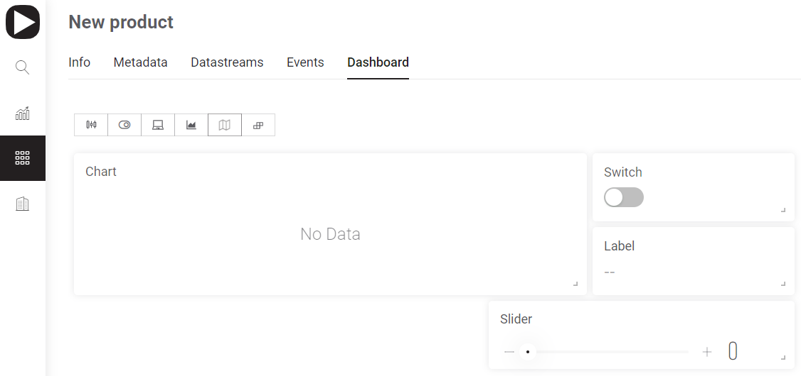

# Dashboard

It's designed to group and visualize data of selected Datastreams in Widgets \(interface modules\). Each of them performs a specific input/output function when communicating with the hardware. There are 5 types of Widgets:

* \*\*\*\*[**Slider**](slider.md)\*\*\*\*
* \*\*\*\*[**Switch**](switch.md)\*\*\*\*
* \*\*\*\*[**Label**](label.md)\*\*\*\*
* \*\*\*\*[**Chart**](chart.md)\*\*\*\*
* \*\*\*\*[**Map**](map.md)\*\*\*\*

\*\*\*\*

