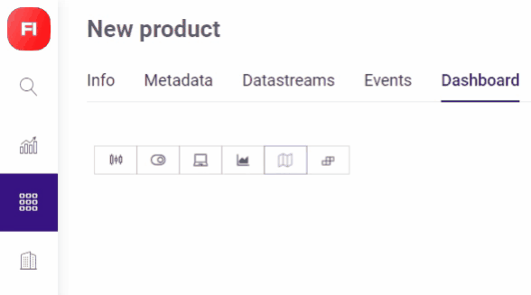

# Label

* **Label** – name a Label widget so you or your client understand what it's about     
* **Source** – there are two fields:   
  * **Choose Source** contains _**Datastreams used in the Product**_. Select one;   
  * the left is _**Source agregation type menu**_ it's used to select an option to be viewed:  

    **AVG of** will plot average value per minute;  

    **Raw of** data will plot using all the data available;  

    **SUM of** will summarize all incoming values to the specified Virtual Pin;  

    **MIN of** will plot minimum value per minute;  

    **MAX of** will plot maximum value per minute;  

    **COUNT of** will plot the number of times data was sent by device per minute;    
* **Suffix** – inches, lbs, oz, minutes, °F, etc., that will be shown after the value; 
* **Text Alignment** – 3 options are available: Left, Center, Right; 
* **Background**  
  * disabled **Change color based on value**:
    * **Background** – pick a color for Label widget background from palette or define it by color number input
    * **Text** – same here; 
  * enabled **Change color based on value**:
    * set **MIN** and **MAX** values and Background and Font colors \(as it's described in previous paragraph\);
    * **Custom Text \(optional\)** – value can be replaced by any text message up to 200 characters \(be sure to set corresponding Label widget size\);
    * default set is of 3 options and it can be changed in range from 1 to as much as you need:
      * click **+** button under the last MIN field to _**increase**_ set;
      * hover to the right from CUSTOM TEXT field, _**Delete**_ button will appear; 
* **Level** – enable it by switching **Show level** on to visualize accordingly to values set in **MIN and MAX Value** fields below.

