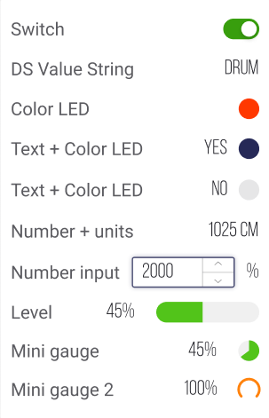

# Modules

This widget is extremely useful in cases your Product devices use detachable modules that can be attached accordingly to use conditions.  
Each module has it's own tools, units, details that are represented by Datastreams sets configured under each module.

_Example:_   
Your Product is a road cleaning machine and it has summer setup with fan and dry broom modules and winter setup with snow brush and dryer modules. Fan and dryer use socket A for connection, broom and brush use socket B. Each module has Datastream set to represent the connectivity such as V0 for fan and V1 for dryer. So in Display Data for socket A you can switch between Fan and Dryer by enabling and disabling those Datastreams. Once connectivity DS is set to ON all the other Datastreams of Module will be displayed in Socket A tab. 


Check the Datastreams you want to use in modules to have Save raw data option enabled.


### Module entities:

Module setup modal window is split to configuration part \(on the left\) and preview window \(on the right\).

**Name** – widget's name. For example it can be "Socket A", "Dock 1", etc.

**Add Module** – click this button to add modules. Once added you can move or delete them using appropriate buttons on the right to modules names and switch to configuring them with click on Settings button on the left to modules names.

**Module Name** – detachable module name. E.g.: Fan, Dry Broom, Snow Brush, Dryer

**Is Enabled Datastream** – turn on/off Datastream that makes all other Datastreams that are related to the Module visible in Display Data.   
_Example_: your module is fan, it has datastream V0. Once you attach the fan to the socket V0 switches from 0 to 1 that enables all other datastreams values display, such as RPM, fan LED color, voltage, etc. 

**Display Data** – setup Datastreams sets and their view for each Module you add.

1. **Add Datastream** – click to add and set up Datastreams which values or states will be displayed
2. **Set View Type** – define Datastreams values/status view by accessing dropdown menu on the right of the selected Datastream. _**Note**:_ type limitations can be applied in the list accordingly to the selected Datastrem properties

**Modules Arrangement inside the Widget** – set vertical or horizontal order. Scrollbar will appear if there are a lot of modules.

 

