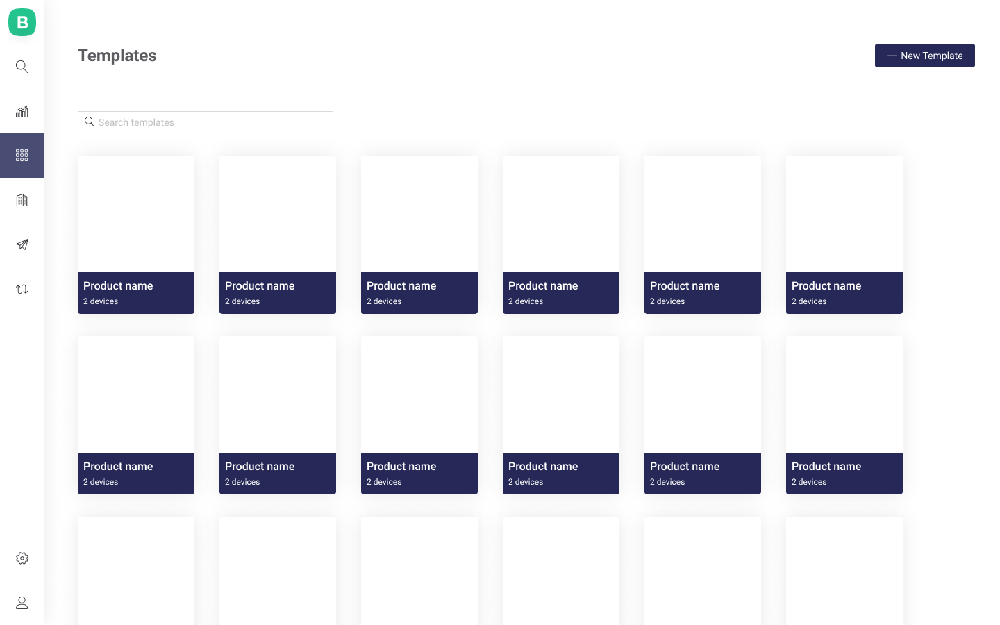

# Templates Management

## Create a Template

1. Click **New Template** button to start configuring the Template
2. Provide basic Template info in modal windoe opened
3. Fill [Info](info/), [Metadata](metadata/), [Datastreams](datastreams/), [Events ](events/)and [Dashboard ](dashboard/)tabs contents 
4. Click **Save** once you've finished the setup.

## Edit a Template

Click Product **tile** to view the Template.   
Here you can navigate through **tabs**. **Edit** and **Clone** options are available.

## Delete a Template \(critical action\)

1. Click Template **tile** to view it's settings
2. Click **Edit**
3. Delete button will appear
4. Click **Delete** button
5. Confirmation modal window will appear
6. **Type DELETE** in the confirmation field and mark the checkbox to confirm the action
7. Click **DELETE**

## Un/assign Template to an Organization

1. Navigate to **Organization tab** \(left menu\)
2. Open Organization with **click on it's tile**
3. Navigate to Organization's **Templates** tab
4. Templates tile screen will open
5. Click **Edit** 
6. **Click tiles** to add/remove Templates. Active Templates are marked with green tick, disabled have tiles with reduced colors. 
7. Once the changes are made click **Save**.

