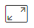
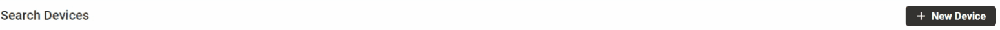

# !Search

Here you can perform quick or manual search of [devices](devices-1/), [locations](locations.md), [organizations ](organizations/)and [users ](users/)you have access to by different criterias according to filtering options you select.

This is the first screen everybody signed in to Blynk Web Dashboard sees.

There are 3 segments \(left to right\):

## **Main Navigation Panel** 

Use it to navigate to ther sections. It's available in anytime and almost anyplace of Web Dashboard. Read [this article](../../../tutorials/getting-started/common-navigation-and-actions-reference.md) to learn Blynk navigation and actions basics please.

## **Search Filtering Panel** 

Here you can select View Panel contents. Click section name row to switch View panel to search mode or click one of the options available for manual search in table:

* [Devices](devices-1/)
  * **All** – view all Devices available \(your and your clients organizations and other types sub-organizations\)
  * **Organization devices** – view only your organization Devices
* [Locations](locations.md) \(can be [changed](../settings/application-settings/general.md) to Job Site or Facility\)
  * **All** – view all Locations available \(created by your organization and sub-organizations members\)
  * **Organization Locations** – view Locations created by your organization users
* [Organizations](organizations/)
  * All – view all organizations you have access to
  * No devices – view organizations \(you're allowed to access\) containing no devices 
  * No users – view organizations \(you're allowed to access\) containg no users
* [Users](users/)

  * All – view users of all organizations you have access to
  * Organization users – view users of your organization only
  * With no devices – view users of all organizations \(you have access to\) with no devices assigned

## **View panel** 

It previews main values of available Devices, Locations, Organizations and Users depending on Search filtering panel selection \(Devices table is open by default\) and search results.  
  
_Actions available:_ 

* **Full screen view** – click pictogram to hide search filtering panel 

* **Create new entity** – ****click **+ New Device/Location/Organization/User** \(top right button\)

* **Switch Table/Map views** – click switch to change the view 

### **Quick search view** 

1. Start typing entity name or known criteria value to perform a search \(search refine is supported\). Search results segmented by criteria will be opened in dropdown list.
2. Click on search result you need to open the table viewing the entities values.
3. Select \(bulk actions are supported\) and open entity you need for further actions.  

### Manual search view 

* Table – list of entities \(entities specific table descriptions are in lower level articles\) 
* Locations – view of entities on the world map

