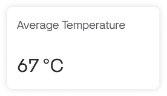

# !Dashboard

Here users can view and/or change Device data Datastreams in Widgets that were created during [Template's Dashboard setup](../../../products/dashboard/).

Select or adjust Time Period using the switches on top of the tab.

6 widget types can be met in this tab \(depends on what's set up by Template owner\):

**Slider** – allows to view and send values to Virtual Pin of the selected Device. Usage examples: volume, brightness, RPM, flap position control, etc.. Move slider **handle** or fine control steps **+** and **–** buttons \(optional\) to set the value.   
Please keep in mind that different step ammounts can be set to handler and buttons.

**Switch** – allows to send commands and view binary statuses of the device, such as power/option ON/OFF

**Label** – shows value of Virtual Pin e.g. length/distance, mass, duration, volume, temperature and other data types including strings.Also it can show level/progress bar \(horizontal or vertical\) and/or have widget colors changes based on getting different predefined values.

**Chart** – it's used to visualise live and historical data. You can use it for sensor data, for binary event logging and more. Chart display can be of 4 types: _Line, Area, Column, Stepline_

General chart properties:

* **Values axis** \(vertical\) – each Datastream added to Chart widget has it's scale on the right and left. It can be set manually or to be autoscaled during Template dashboard setup.
* **Timeline Axis** \(horizontal\) – helps to find values actual for the exact time the search is performed.
* **Hover the chart** – views value ant time for each selected point for each Datastream.

**Map** – 

**Modules**  

