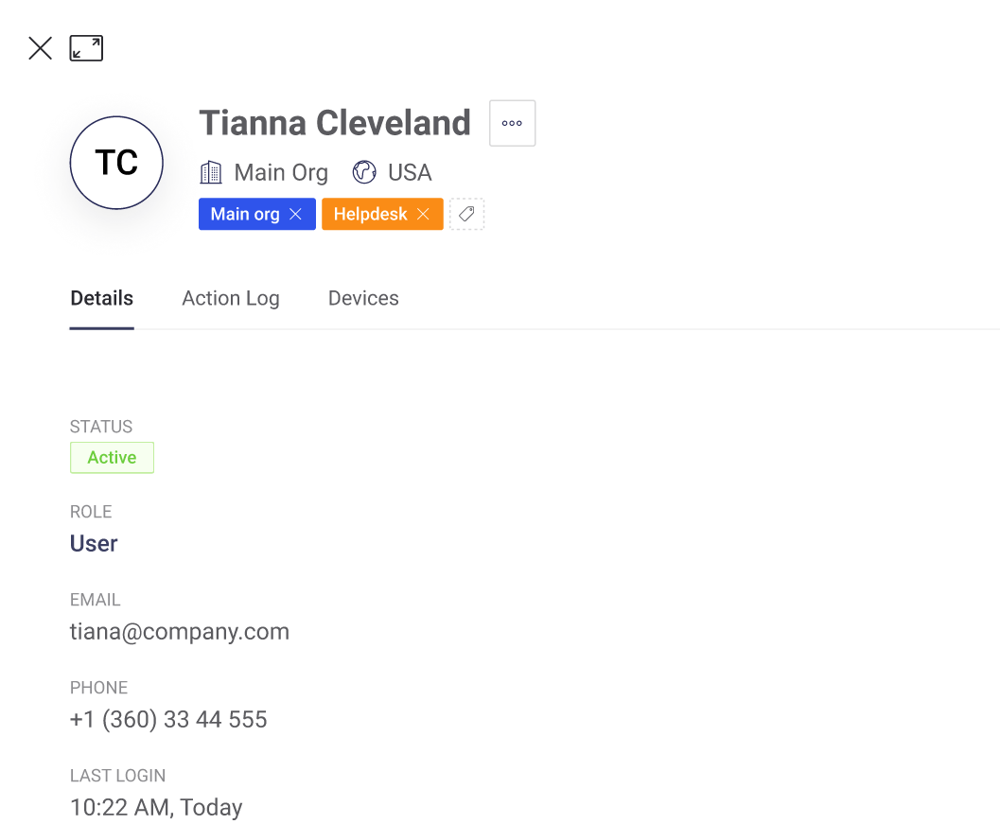

# User View

You can see information about users in the section of users

By clicking on the name of a user in the list of users, you can see information about a specific user

## User Profile

The User profile contains information about the user name, user organization, user country, information about the user status, role, email, last login, and there may also be other custom information

## 

## 

## Information

## Actions Log

## Devices

