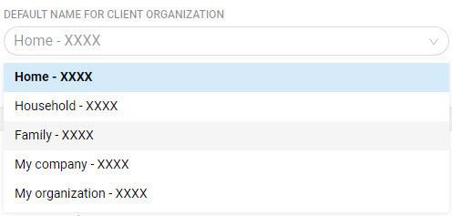

# Sign Up

Sign Up screen is separated in two view parts: **Sign Up** settings on the right and Sign Up window **Preview**.

## Sign Up

### Links

**Privacy Policy Link** – `https://` format link placeholder

**Terms and Conditions Link** – __`https://` format link placeholder

**Contact Email** – placeholder for an Email of administrator or tech-support who handles user invitations  

### Client Sign Up

Enabling this option allows your Clients to be able to sign up by themselves by web and mobile apps.  
\(_Client Sign Up is open_ picture in Preview\)

#### User Metadata Collection

**Collect user metadata on Sign Up** – by enabling user data collection you are confirming that you have provided all legally required disclosures \(e.g. Privacy Policy, Terms Of Service\) and are compliant with all local privacy laws and regulations \(eg. GDPR, CCPA, etc.\) of the geography of your company and that of your users.

Mark **Checkboxes** accordingly to your requirements.  
**Custom fields** can be used for some specific data you set. 30 Characters limit.

#### Default Name for Client Organization 

This selection defines what names should be generated for Clients Organizations.  
Later they can be found as sub-organizations of Clients organization.

### Partner Sign Up

Enabling this option allows your Partners to be able to sign up by themselves and have special access and features by web and mobile apps.  
\(_Partner Sign Up is open_ picture in Preview\)

#### Enable at least one Partner type to work with

4 independent options here, enable those needed:

* Distributor 
* Reseller 
* Contractor 
* Installer

#### User Metadata Collection

By enabling organization and user data collection you are confirming that you have provided all legally required disclosures \(e.g. Privacy Policy, Terms Of Service\) and are compliant with all local privacy laws and regulations \(eg. GDPR, CCPA, etc.\) of the geography of your company and that of your users.

Mark **Checkboxes** accordingly to your requirements.  
**Custom fields** can be used for some specific data you set. 30 Characters limit.

#### Sign Copytext and Links

## Preview

That's what new users will see after click on Sign Up button on the welocme screen. There are 4 options:

