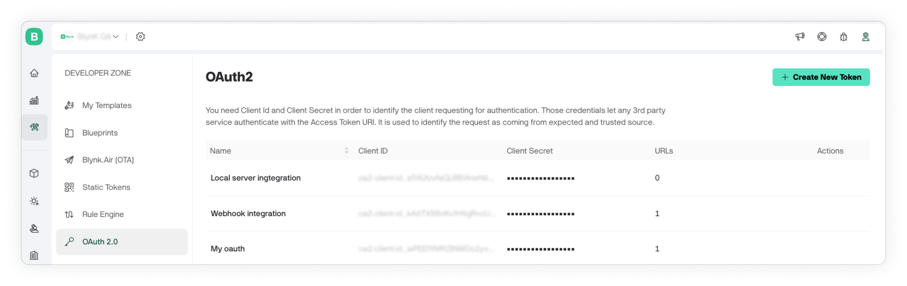

# OAuth2


You need Client Id and Client Secret in order to identify the client requesting for authentication. Those credentials let any 3rd party service authenticate with the Access Token URI. It is used to identify the request as coming from expected and trusted source.


## Table contents

There are 4 specific columns:

* Name
* Client ID
* Client Secret
* URLs

## Create New Token

* **Name** – we recommend to use web services names up to 64 symbols.
* **Redirect URLs** – add up to 11 \(click **Add URL** and **Bin** buttons\) URLs to external web services 

## Actions

* **Hover Client ID** or **Secret** to view it – hint will appear, click **Copy** pictogram to put it to your clipboard
* **Actions Menu**
  * **Edit** – \(also can be accessed by click on row area\) opens _Token modal window_
  * **Delete** – opens delete modal window. Follow the steps described there.

