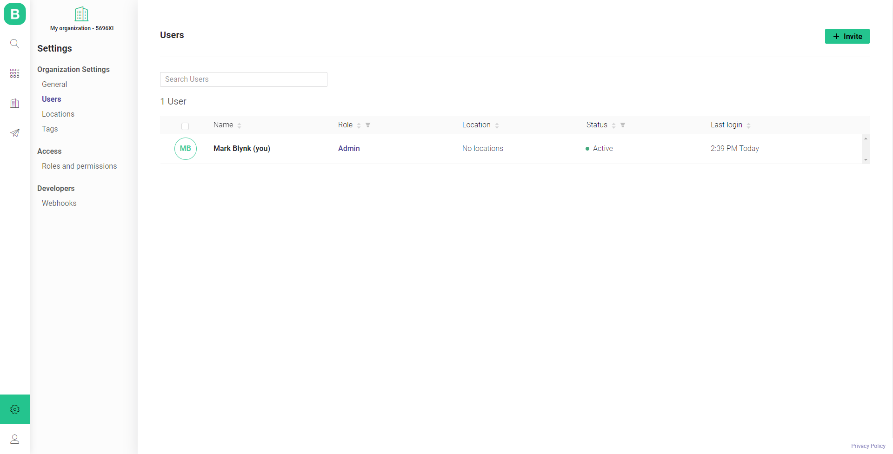
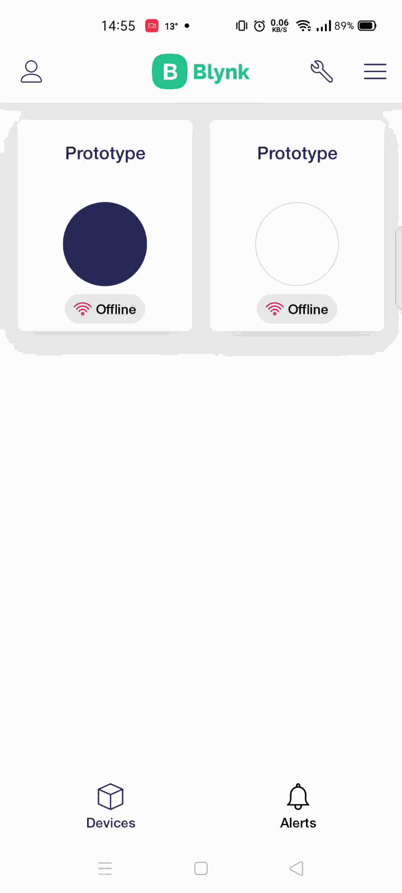

# User Invitation


Eligible access and permissions are needed to perform actions below.


There are several places where you can invite new users:

* Search - Users - **Invite New User**

* Settings - Organization settings - Users - **Invite**

* Organizations - %Organization\_name% tile - Users tab - **Invite**

* Blynk.App: Profile - %Organization\_name% - Members tab - **Invite new Member**

