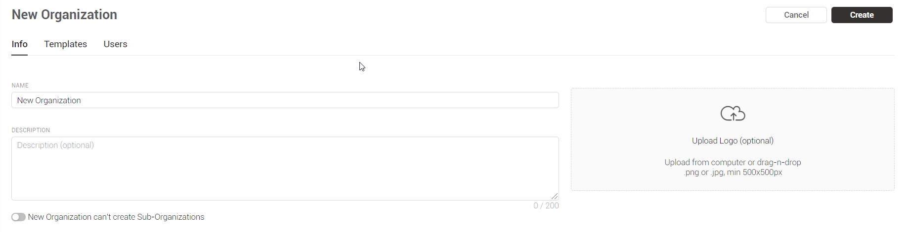
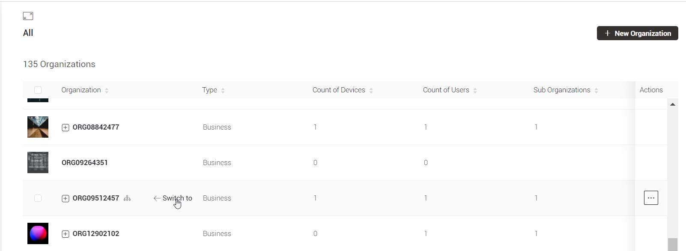
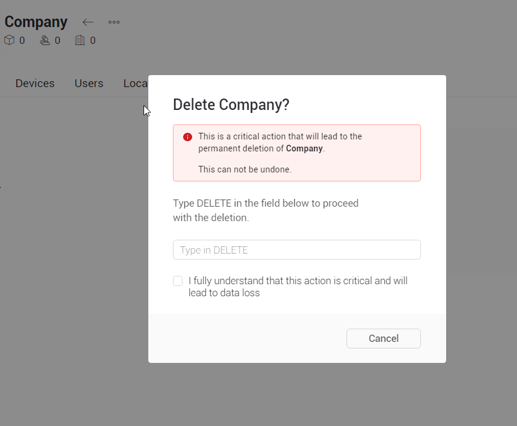

# Organizations

## Overview

## Search Organization

You can search for any metadata across devices, organizations, and users. Simply start typing.

## Create New Organization

Click New Organization button to perform this action.  
You'll be redirected to Organizations tab New Organization window.  
Follow the steps of [this article]() to succeed.

### \*\*\*\*

### **Tab Info**

You need to fill in the information about the organization:

\_\_

**Organization Name** – can be up to 80 characters. _Use letters, digits, space or '.', '-', ''' characters_

**Description** \(optional\) – organization info container. 500 characters limit with counter at the bottom

**Logo** – upload Logo \(optional\) Upload from computer or drag-n-drop Organization logo in .png or .jpg formats and minimal resolution of 500x500px

Сan create Sub-Organizations – switch it on/off accordingly to allow/prohibit your to create and keep Sub-Organizations inside the Organization .

### \*\*\*\*

### **Tab Templates**

You can to select the device **Templates** that your **Organization** will work with

### 

### Tab Users

You can invite users to your organization

## List of Organizations

The **List of Organizations** contains information about all **Organizations** in your company. In the **List of Organizations** you can see information about:

* **Name**
* **Type**
* **Count of Device**
* **Count of Users**
* **Sub Organizations**
* **Id**
* **Actions**

You can view the profile of any **Organization** from the **List of Organizations** by clicking on the name of the organization

You can go to any organization by clicking on the "**Switch to**" icon.

## Page of Organization

Here you can view or edit information about the organization

### **Actions**

* **Edit Settings** – redirects you to the [Organization Settings](../settings/organization-settings/) menu
* **Manage Users** – redirects you to the [Users](../settings/organization-settings/users.md) section in the [Organization's settings](../settings/organization-settings/), where you can manage the users of your organization.
* **Transfer Organization** – detailed information about transfer of the organization is described in in the  [Transfer Organization](transfer-organization.md) section
* **Delete Organization** – modal window will appear. Type DELETE and confirm the action are required.

On the tabs of the organization, you can see information about the organization, its device, users and locations.

### Tabs

* \*\*\*\*[**Information**](./#page-of-organization)\*\*\*\*
* \*\*\*\*[**Devices**](../devices/#table-view)\*\*\*\*
* \*\*\*\*[**Users**](../settings/organization-settings/users.md)\*\*\*\*
* \*\*\*\*[**Locations**](../settings/organization-settings/locations.md)\*\*\*\*

