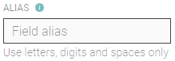

# Alias

Alias is an alternative Datastream name which can be changed by the end-user. For example, it can be used by voice assistants like Amazon Echo \(Alexa\) and Google Home Assistant .

You can only use letters, digits and spaces. No other characters are allowed


Duplicate aliases are not allowed.


