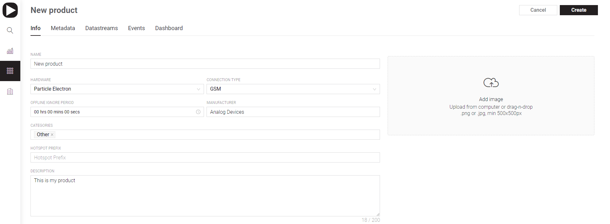
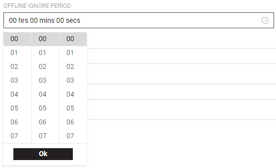

# Info

* **Name** – unique Template name that will be used during Device check and connection plus it's a default Device name \(paste it to Sketches "\#define BOARD\_NAME" string replacing the "Template Name"\). Make it readable and understandable. Use only letters, digits, and spaces. 100 characters limit.  
* **Hardware**– dropdown list of supported Boards. Start typing the name of  board that will be used in your product and choose correct one from search results or select it manually from the list.

* **Connection Type** – dropdown list of various possible board connections. Be sure to select correct one that is used by your product's Board.

* [Offline Ignore Period](offline-ignore-period.md)– optional setting. 00 hrs 00 min 00 sec format.

* [Manufacturer](manufacturer.md)– a name of a Template maker that will be used during Device check and connection

  It's an Organization name often.  

* [Template ID](template-ids.md) – a unique ID that will be automatically generated by server once a Template is created. It's used for recognition of in/correct Devices by Blynk.App during [Device Provision](../../../mobile-applications/device-management/add-new-device.md). Copy and paste it to your Device's Firmware `define BOARD_TEMPLATE_ID` value.

* [Categories ](categories.md)– dropdown list of various devices groups that are used by Voice Assistants.

* [Hotspot Prefix](hotspot-prefix.md) – Device's SSID that will be used during the Provision. 
* Description – brief \(up to 200 characters\) description of a product's purpose and functionality. 
* Logo – add image/logo of your Product that will be displayed in Templates List tile. Upload from computer or drag-n-drop .png or .jpg, min 500x500px

