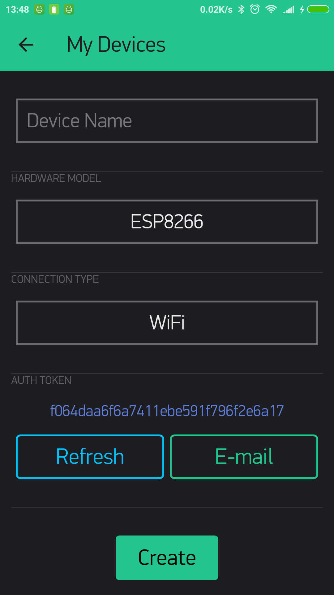

# Devices

## Predefined Filters

There are two filters in Search Filtering Panel that can be applied to both Table and Map views.

**All** – view all Devices available \(your and your clients organizations and other types sub-organizations\)

**Organization devices** – view only your organization Devices

## Quick search

Can be performed by the following criterias:

* Device Name
* ICCID
* Firmware Version
* Organization Name
* Device Model
* Template Name
* Device Owner Name
* Hotspot Name
* Contact Email, Street Address, Phone Number
* IMEI
* Auth Token
* Serial Number
* Device ID
* Tag
* other Metadata set in Template

#### Search steps:

1. Click on Devices row in Search Filtering Panel
2. Start typing known value to perform a search \(search refine is supported\). Search results segmented by criteria will be opened in dropdown list. 
3. Click on search result you need and you'll get all the Devices containing it in Table View
4. Sort/filter Table View columns to make it easier to view found Devices
5. Select \(bulk actions are supported\) and open Device\(s\) you want to apply further actions to.

## Table view


Please mind Lazy Loading the Table uses to view Devices list – it's necessary to scroll down to load all Devices!


Devices view order can be sorted by any column exists:

* Device name
* Device owner
* Status
* Device model
* Last Updated
* Organization
* Activation date
* Template name
* Location
* Serial number
* Firmware version
* Device ID

**Navigation:**

* Click on **Device Name** – opens [Device View](device-view/):
* Click on **Device Owner** – opens [Device Owner profile](device-owner-view.md): 
* Click on **Organization Name** – opens device [Organization](../../organizations.md): 

## Actions

### Create Device

Click **New Device** button to perform this action.  
New Device modal window will open:

1. **Choose template** – click this field and select the Template from the dropdown list
2. **Device Name** – give it a meaningful name up to 60 characters. Use only letters, digits, and spaces.
3. Click **Create** button to confirm the action.

_**Done!**_  
All the settings with their default values will be taken from [Template](../../products/).  
[Device View](device-view/) will be opened.

### Single actions \(hover to the right of each row\):

* **Rename** – opens Rename Device modal window. Input new name up 60 characters here. Confirm.

* **Download report** – opens Generate Report modal window were you can download and send by Email .csv formated Device report with data settings you need.

* **Transfer** – here you can change Device Owner by providing Email of a new one.

* **Edit Product Dashboard** – redirects to [Template Dashboard](../../products/dashboard/) edit section \(Admin role required\)
* **Notification settings** – opens quick setup drawer for [Notifications Management](../../../getting-started/notification-management.md) 
* **Erase data** \(critical action!\) ****– deletes of Device Data that was sent/received by Device and API.
* **Delete Device owner** \(critical action!\) – unassignes Device from previous Device Owner.
* **Delete Device** \(critical action!\) – deletes Device entry and all it's data.


All the critical actions lead to the permanent deletion of selected entities.   
Don't worry, these actions apply only after confirmations in modal window opened.


### Bulk actions \(upper action menu icon\):

* **Apply** [**tag**](../../settings/organization-settings/tags.md) ****– ****virtual grouping that can ease further searches of these devices.
* **Export devices CSV** – click it to download Devices table content in .csv format. 
* **Notification settings** - verify saved settings in single actions test..
* **Delete** \(critical action!\) – deletes all selected Devices entries and all their data.


Please mind Lazy Loading the Table uses to view Devices list – it's necessary to scroll down to load all Devices!


## Map view

Here you can search and view Devices \(depending on selected filter\) by their locations.

Applied filtering option and Devices count are shown at top left.

Map supports mouse scroll zoom in/out.  
Hold left mouse button to move the map.

You'll see dots of two colors on the map:

* **Blue** – devices group with built-in devices counter. Click it to zoom in and view devices.
* **Orange** – device. Click it to view device name, template logo, actual connectivity status and latest in/accessibility date. Click on Device Name on map opens [Device View](device-view/).

