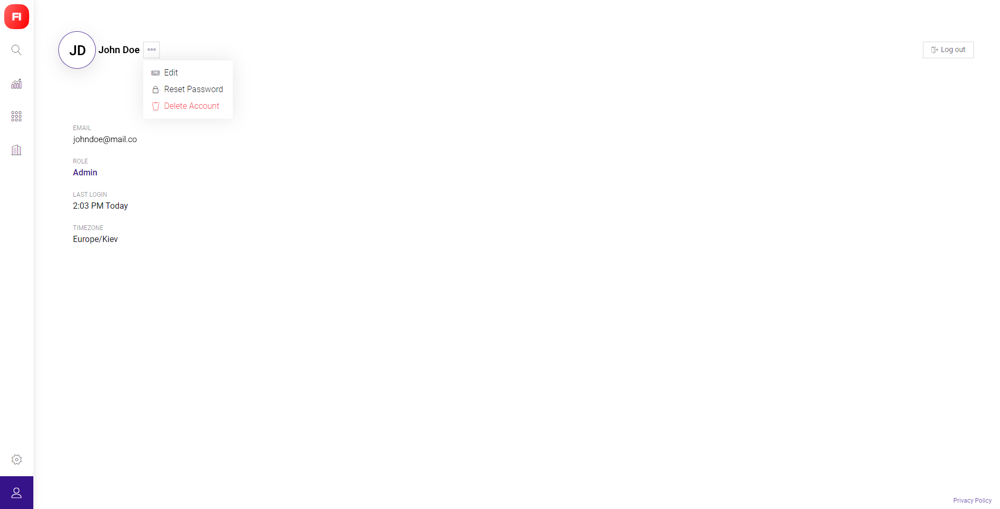
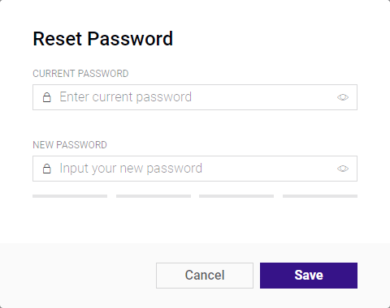
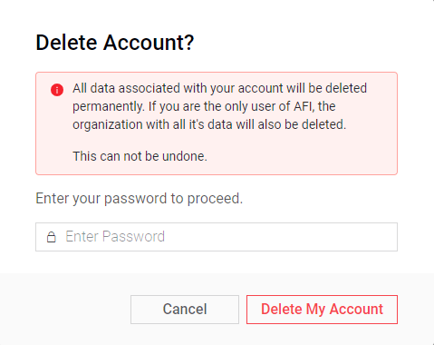

# User Profile

## Basic view set

\(custom fields can be added to Sign Up by SuperAdmin\)

* Name
* Email
* Phone Number \(field is hidden if no information was provided\)
* Last Login 
* Timezone \(this setting is defined by Organization's Timezone\)

## Actions

Hover Actions Menu near the Name to access following options.

### Edit

Click to open User Profile edit modal window

**Name** – here you can edit user name displayed in Blynk Platform. Use only letters, hyphens, dots and spaces. 60 characters limit.

**Email** – is set once during the Invitation or Sign Up procedure. Cannot be edited.

**Phone Number** – international phone numbers format regexp is applied here. Country code can be found by selecting country flag from the dropdown list. Country flag change is autoapplied on number typing.

### Reset Password

Click to open Reset Password modal window

1. **Type current password** \(click "eye" pictogram to show/hide the password\)
2. **Type new password** with minimum of 8 characters \(click "eye" pictogram to show/hide the password\) Our recomendations on password creation:
   * Use uncommon words
   * Use non-standard uPPercaSing
   * Use creatif spellllllling
   * Use non-obvi0u$ number$ & symbo1s There's a safety-meter bar under this field. It's safety status hint and color will be changed from red to green as the password turns stronger.
3. Click **Save** to apply the changes.

### Delete Account

_**Warning**_**:** All data associated with your account will be deleted permanently. If you are the only user of an Organization, the organization with all it's data will also be deleted. This can not be undone.

1. **Make sure** you are about to delete the account
2. **Type current password**
3. Confirm the action by clicking **Detete My Account**

### Logout

Click to end the session.  
You will be redirected to Sign In / Sign Up screen.

